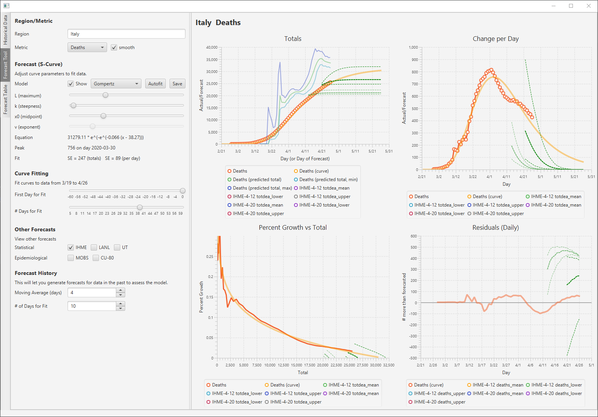

# covid-analytics
**Purpose:** Modeling, simulation, and analytics of COVID-19 data.

Uses historical data from https://github.com/CSSEGISandData/COVID-19 and forecasts from a variety of sources.

The repository includes COVID-19 data sources, time series analytics, a UI tool for exploring data/forecasts, and other modeling/simulation tools.

## Forecasting Tool
The forecasting tool is a JavaFx application (Kotlin + TornadoFx) with views for viewing historical data and forecasting future data.

Here is the historical view:

Here is the forecast view:

